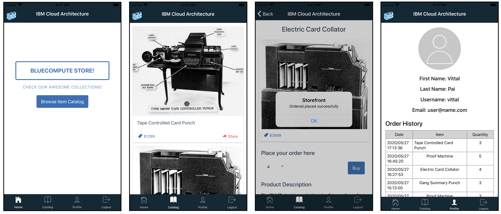
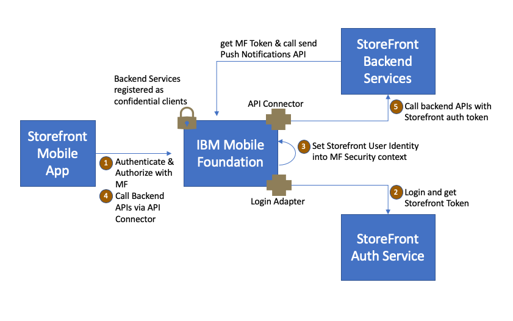

Storefront Ionic Mobile Application
===
## Overview
This is a IBM Mobile Foundation based Ionic Mobile Application frontend to the storefront application.  The application allows mobile app users to browse the storefront catalog items, make an order and review profile.



## Component Interaction Design
IBM Mobile Foundation is positioned as the mobile gateway to the StoreFront providing mobile app and device security over and above the Storefront user authentication and authorization.  All calls to from the mobile app to the Storefront backend services are made via Mobile Foundation to exploit this comprehensive security. The Storefront backend services are registered with Mobile Foundation as confidential clients with appropriate allowed scopes to enable them to invoke the Send Push Notifications API.



### Pre-requisites
- Ionic CLI Version 5.4.16 - https://ionicframework.com/docs/cli
- Storefront server components installed and running - microservices, dependent DBs, IBM Mobile Foundation
- IBM Mobile Foundation CLI - https://www.npmjs.com/package/mfpdev-cli

### Usage
1. Ensure that the Storefront services including Mobile Foundation services are deployed and running
2. Clone this repo locally and change current working directory to storefront-mobile-ionic
```
git clone git@github.com:ibm-garage-ref-storefront/storefront-mobile-ionic.git
cd storefront-mobile-ionic
```
3. If you are setting up Storefront services for the first time or have reset it then you will need to configure Mobile Foundation services for this StoreFront mobile application as follows: -
    - This StoreFront Mobile Application is designed to receive Push Notifications about the progress of StoreFront order shippments. To enable Mobile Foundation Push Notifications service for this application you must configure the service for Push Notification Credentials (FCM, APNS).  Edit `mfpconfig/app_config.json` file and update it for these credentials under json object `services.push.settings`.  To know more about what these settings and credentials are about lookup https://mobilefirstplatform.ibmcloud.com/tutorials/en/foundation/8.0/notifications/sending-notifications/#setting-up-notifications 
    - All other required configurations are already preset into `mfpconfig/app_config.json` file
    - To enable push notification on Android remember to add google-services.json into the directory `ionic` 
    - Edit `mfpconfig/server_config.json` and input the endpoint url, port and admin credentials for the Mobile Foundation Server
    - Save `mfpconfig/server_config.json` and `mfpconfig/app_config.json` files
    - From the root of this repo clone i.e. from the directory storefront-mobile-ionic run the following command
      ```
      mfpdev app register
      ``` 
      and you must see the following output
      ```
      Registering to server:'http://<mobile foundation endpoint url>:<port>' runtime:'mfp'
      Registered app for platform: android
      Registered app for platform: ios
      ```
Now all the storefront services are up and running and Mobile Fountation is also configured.

4. Edit ionic/config.xml file and update the element <mfp:server runtime="mfp" url="<url for mobile foundation server" /> for the url endpoint of the Mobile Foundation server
5. From a command-line window, navigate to the project's root folder and run the commands:
    - `cd ionic` - to navigate to application folder
    - `ionic cordova platform add ios` or `ionic cordova platform add androids` - to add a platform.
    - `ionic cordova run` - to run the application.

6. Run the application to view the catalog, make an order and review the user profile.
 

### Version
ionic-angular 3.9.2

### Supported Levels
IBM MobileFirst Platform Foundation 8.0

